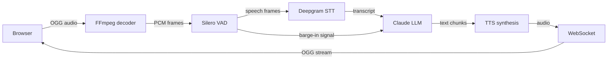

# TechNova Voice Bot

**Real-time voice AI with barge-in** — interrupt mid-response and get instant context-aware replies. WebSocket-based pipeline with <300ms time-to-first-byte.

[](https://github.com/ChunkyTortoise/technova-voice-bot/actions/workflows/ci.yml)

A complete voice pipeline — speech-to-text (STT), LLM reasoning via Claude, and text-to-speech (TTS) — for an e-commerce electronics store.

## Pipeline Architecture



## Tech Stack

| Layer | Technology | Why |
|-------|-----------|-----|
| Backend | FastAPI + uvicorn | Async WebSocket support |
| Audio transcoding | FFmpeg (OGG input) | Streamable OGG/Opus, not WebM |
| VAD | Silero VAD (ONNX) | ~20 MB, no PyTorch dependency |
| STT | Deepgram Nova-3 | Sub-300ms streaming, best WER |
| LLM | Claude claude-sonnet-4-6 | 1.19s TTFB, ~3s total round-trip |
| TTS | Deepgram Aura-2 | ~90ms TTFB, same API key as STT |
| Session state | Redis | Survives Render spin-down |
| Database | SQLite (aiosqlite) | No expiry (unlike Render Postgres) |

## Quick Start

### Prerequisites
- Python 3.12+
- FFmpeg (`brew install ffmpeg` or `apt install ffmpeg`)
- Redis (`brew install redis` or Docker)
- API keys: Deepgram, Anthropic

### Local Development

```bash
git clone https://github.com/ChunkyTortoise/technova-voice-bot.git
cd technova-voice-bot

# Install dependencies
pip install -r requirements.txt
pip install -r requirements-dev.txt  # for tests

# Configure
cp .env.example .env
# Edit .env: add DEEPGRAM_API_KEY and ANTHROPIC_API_KEY

# Start Redis
redis-server &

# Run
uvicorn app.main:app --reload --port 8000
# Open http://localhost:8000
```

### Docker (single command)

```bash
cp .env.example .env
# Edit .env with your API keys

docker-compose up
# Open http://localhost:8000
```

### Deploy to Render

1. Push this repo to GitHub
2. Create new Render Blueprint → connect repo → `render.yaml` handles the rest
3. Set `DEEPGRAM_API_KEY` and `ANTHROPIC_API_KEY` in Render dashboard
4. The `CORS_ORIGINS` is pre-set to your Render URL in `render.yaml`

## Architecture Decisions (Audit Fixes Applied)

| Fix | Issue | Solution |
|-----|-------|----------|
| #1 | WebM/FFmpeg pipe unreliable | Use OGG/Opus — streamable format |
| #2 | PyTorch OOM on Render free | ONNX Silero VAD — ~20 MB not ~400 MB |
| #3 | PostgreSQL 30-day expiry | SQLite — no expiry, persists on mounted volume |
| #4 | Session lost on refresh | localStorage session_id persistence |
| #5 | Single-stage Dockerfile | Multi-stage build — builder + runtime |
| #6 | CORS_ORIGINS=* insecure | Default to localhost; set Render URL in render.yaml |
| #7 | Sentence split on $19.99 | Regex with negative lookbehind for digits + abbreviations |
| #8 | No rate limiting | 5 concurrent WebSocket connections per IP |
| #9 | Lock TTL too short | 30s asyncio.Lock per session + Redis heartbeat |
| #10 | sampleRate constraint ignored | Removed — FFmpeg handles resampling |
| #11 | render.yaml Redis reference broken | Redis service defined in render.yaml |
| #12 | AudioContext.close() on barge-in | GainNode mute/unmute — no context recreation |
| #13 | Test deps missing | requirements-dev.txt separate from requirements.txt |
| #14 | Latency budget ignores buffer | 500ms sentence flush timeout documented |
| #15 | No structured logging | structlog with JSON in production |
| #16 | Order demo invisible | UI hint: "Try order TN-10023 or TN-10042" |
| #18 | Render 75s WS idle timeout | Client sends ping every 30s |

## Demo Mode

Run without any API keys — the bot responds with pre-scripted demo answers:

```bash
# Demo mode — no DEEPGRAM_API_KEY or ANTHROPIC_API_KEY required
DEMO_MODE=true uvicorn app.main:app --reload --port 8000
# Open http://localhost:8000
```

Demo mode activates automatically when `DEEPGRAM_API_KEY` is not set. It mocks STT, LLM, and TTS so you can exercise the full WebSocket pipeline without API credits.

| Feature | Live Mode | Demo Mode |
|---------|-----------|-----------|
| STT | Deepgram Nova-3 streaming | Pre-scripted responses |
| LLM | Claude Sonnet streaming | Mock responses |
| TTS | Deepgram Aura-2 | Silent audio |
| Barge-in | Real VAD | Simulated |
| Sessions | Redis + SQLite | In-memory |

## Testing

```bash
pytest tests/ -v            # 171 tests
pytest tests/ --cov=app --cov-report=html
```

## Latency Budget

| Component | Target | Notes |
|-----------|--------|-------|
| VAD detection | <10ms | Silero ONNX, cached after first session |
| STT (Deepgram) | <150ms | Streaming, not batch |
| LLM first token | <200ms | Claude Sonnet streaming |
| TTS synthesis | <100ms | Streaming audio synthesis |
| WebSocket overhead | <50ms | Local/regional |
| **Total TTFB** | **<300ms** | Voice turn around time |

> Note: First session has ~5-10s VAD cold start while Silero model loads. Cached after that.

## Production Features

- **Pipeline Latency Tracker** — component-level timing (STT, LLM TTFB, LLM total, TTS, E2E) with P50/P95/P99 percentile histograms. GET `/api/metrics/latency`
- **Circuit Breaker + Model Fallback** — per-service async circuit breakers (CLOSED/OPEN/HALF_OPEN). LLM fallback: Sonnet to Haiku on circuit open. TTS fallback: text-only. GET `/api/health/circuits`
- **Function Calling / Tool Use** — Claude tool_use API with 3 voice-enabled tools (order lookup, product search, callback scheduling). Multi-turn tool loop with max 3 iterations. Tool call events streamed to browser
- **Per-Call Cost Tracker** — USD cost breakdown per turn (Deepgram STT + Anthropic LLM + TTS). Model-aware pricing (Sonnet vs Haiku). GET `/api/costs/summary`
- **Semantic Caching** — (planned) embedding similarity cache for repeated queries

## Browser Client Features

The included browser client (`static/app.js`) provides:
- **Real-time waveform visualizer** — live audio amplitude display during speech
- **Auto-reconnect** — exponential backoff reconnection on connection loss
- **Barge-in support** — interrupt Claude mid-response by speaking

## Certifications Applied

| Domain Pillar | Certifications | Applied In |
|--------------|----------------|------------|
| GenAI & LLM Engineering | Google Generative AI, Anthropic Prompt Engineering, DeepLearning.AI | Claude streaming integration, prompt engineering for voice |
| Deep Learning & AI Foundations | DeepLearning.AI specializations | Silero VAD ONNX model selection, audio signal processing |
| Cloud & MLOps | Google Cloud, IBM DevOps, GitHub Actions | WebSocket session management, Render deploy, CI pipeline |
| RAG & Knowledge Systems | DeepLearning.AI RAG | Conversation context management for multi-turn voice |
