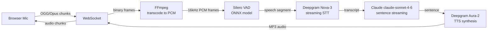

# Spec: technova-voice-bot — Voice AI Production Sprint

## Context

The repo is code-complete with a working real-time voice pipeline: OGG/Opus audio from the browser, FFmpeg transcoding, Silero VAD, Deepgram Nova-3 STT, Claude claude-sonnet-4-6 LLM with sentence streaming, Deepgram Aura-2 TTS. Seventeen architecture fixes are applied and documented in the README.

**What is missing before this project can be presented as portfolio-ready:**

- Test coverage is ~25% (26 tests). `audio_pipeline.py`, `ws_manager.py`, `stt_client.py`, `tts_client.py`, and `mock_clients.py` have zero tests.
- The service is not deployed. `render.yaml` and `Dockerfile` are complete but Render requires a credit card even for free-tier Blueprint deploys.
- The README has no screenshots or GIF demonstrating the voice UI.
- No `CASE_STUDY.md` explaining architectural decisions for recruiters and clients.
- `.env.example` is missing three API key vars: `ADMIN_API_KEY`, `OPERATOR_API_KEY`, `VIEWER_API_KEY`.

**Demo mode** works automatically when `DEEPGRAM_API_KEY` or `ANTHROPIC_API_KEY` is missing. The full WebSocket pipeline, AudioPipeline, and WebSocketManager run; only the STT/LLM/TTS stages are replaced by mock clients. Waves 1 and 2 are fully unblocked and can proceed today.

## Goals

1. Increase test count from 26 to 68+ tests across 7 categories (50%+ coverage target)
2. Deploy to Render OR Fly.io (preferred for voice — edge latency) with demo mode confirmed working
3. Add visual proof: screenshots of the voice UI, waveform visualizer, and a GIF of a demo interaction
4. Publish `CASE_STUDY.md` covering voice AI architecture decisions, including barge-in as headline feature
5. Update `.env.example` to document all env vars
6. Highlight barge-in/interruption handling as the headline premium feature (most voice AI demos lack it)
7. Add canvas-based real-time audio waveform visualizer to the demo UI
8. Add Mermaid pipeline diagram (OGG → FFmpeg → VAD → STT → Claude → TTS → WS) to README
9. Add latency budget table to README (<300ms TTFB target across all stages)
10. Add "Certifications Applied" section in Domain Pillars format
11. Add auto-reconnect with exponential backoff to the demo WebSocket client

## Requirements

| ID | Requirement |
|----|-------------|
| REQ-F01 | Test count shall increase from 26 to 60+ tests (50%+ coverage target) |
| REQ-F02 | New tests shall cover `audio_pipeline.py`, `ws_manager.py`, `stt_client.py`, `tts_client.py`, and `mock_clients.py` |
| REQ-F03 | `.env.example` shall document `ADMIN_API_KEY`, `OPERATOR_API_KEY`, and `VIEWER_API_KEY` with placeholder values |
| REQ-F04 | The API shall be deployed to Render with demo mode working without any API keys set |
| REQ-F05 | The README shall include at least two screenshots of the voice bot UI |
| REQ-F06 | The README shall include a GIF demonstrating a demo mode voice interaction |
| REQ-F07 | `CASE_STUDY.md` shall exist at the repo root covering the 8 key architecture decisions |
| REQ-NF01 | Demo mode shall complete a full voice round-trip (audio in → transcript → LLM response → TTS audio out) end-to-end on Render without Deepgram or Anthropic API keys |
| REQ-NF02 | All new tests shall run in under 100ms each (unit tests only, all external calls mocked) |
| REQ-F08 | The README shall include a latency budget table documenting the <300ms TTFB target: VAD (<10ms), STT streaming (<150ms), LLM first sentence (<200ms), TTS synthesis (<100ms), WS delivery (<50ms) |
| REQ-F09 | The README shall include a "Certifications Applied" section in Domain Pillars format (GenAI & LLM Engineering, RAG & Knowledge Systems, Cloud & MLOps, Deep Learning & AI Foundations), each cert mapped to a specific pipeline component |
| REQ-F10 | The README hero and CASE_STUDY.md shall explicitly call out barge-in/interruption handling as the headline premium differentiator — include a description of the per-session asyncio.Lock approach and why it matters |
| REQ-F11 | The README shall include a Mermaid pipeline diagram showing: OGG → FFmpeg → Silero VAD → Deepgram STT → Claude (sentence streaming) → Deepgram TTS → WebSocket client |
| REQ-F12 | The demo UI HTML shall include a canvas-based real-time audio waveform visualizer (Web Audio API AnalyserNode) that animates during active voice recording |

## Architecture

### Audio pipeline test strategy
`AudioPipeline` wraps `subprocess.Popen` (FFmpeg) and `_vad_probability` (ONNX inference). Both must be mocked to keep tests fast and hermetic. The `_read_pcm` loop uses `asyncio.get_running_loop().run_in_executor` — control it by making `mock_stdout.read` return frames then `b""` to signal EOF. The VAD state machine in `_process_frame` is pure logic once `_vad_probability` is patched.

### WebSocket manager test strategy
`WebSocketManager` has no external dependencies — it is a pure in-memory dict. Use `AsyncMock()` for the FastAPI `WebSocket` object. Tests are synchronous-friendly (just `await` each method call inside `@pytest.mark.asyncio`).

### STT client test strategy
The Deepgram SDK import is deferred inside `connect()` specifically to enable test isolation. Patch `deepgram` in `sys.modules` with `MagicMock()` before calling `connect()`, or bypass `connect()` entirely by injecting a mock `_connection` and setting `_connected = True` directly on the client instance. The latter is simpler and more reliable.

### TTS client test strategy
`DeepgramTTSClient.synthesize()` uses `httpx.AsyncClient` as an async context manager with a streaming response. Patch `app.tts_client.httpx.AsyncClient`. The mock must implement the double context-manager pattern: `__aenter__` on the client returns an object whose `.stream(...)` is also a context manager yielding a response whose `.aiter_bytes()` is an async generator.

### Demo mode test strategy
`mock_clients.py` has no external dependencies. Test each mock class directly: verify `MockTTSClient.synthesize()` returns bytes starting with `b"RIFF"`, verify `MockLLMOrchestrator` cycles through responses, verify `MockSTTClient` consumes chunks and yields a transcript string.

### Deploy architecture
`render.yaml` defines two services: `technova-voice-bot` (Docker web) and `technova-redis` (Redis free). `DEEPGRAM_API_KEY` and `ANTHROPIC_API_KEY` have `sync: false` — they must be set manually in the Render dashboard. When left empty, demo mode activates. The 1 GB disk at `/app/data` persists SQLite and the Silero VAD ONNX model across restarts.

## Waves

---

### Wave 1: Test Coverage Sprint (Unblocked)

**Dependencies**: None
**Estimated time**: 6-8 hours
**Target**: 26 → 68+ tests across 7 categories, 25% → 50%+ coverage

**New files to create** (7 categories):
- `tests/test_audio_pipeline.py` (target: ~15 tests) — VAD state machine, FFmpeg lifecycle
- `tests/test_ws_manager.py` (target: ~10 tests) — connection tracking, IP limits, send methods
- `tests/test_stt_client.py` (target: ~6 tests) — transcript callbacks, connection lifecycle
- `tests/test_tts_client.py` (target: ~8 tests) — streaming synthesis, cancel, HTTP errors
- `tests/test_mock_clients.py` (target: ~5 tests) — WAV output, canned responses, transcript generator
- `tests/test_barge_in.py` (target: ~6 tests) — per-session asyncio.Lock, interruption handling, cancel-and-restart
- `tests/test_e2e_demo.py` (target: ~8 tests) — full pipeline end-to-end in demo mode (mock clients wired to WebSocket)

**Steps**:

#### Step 1.1 — `tests/test_audio_pipeline.py`

All tests use `@pytest.mark.asyncio`. Mock `subprocess.Popen` to avoid spawning FFmpeg. Mock `_vad_probability` to control speech detection without ONNX.

Test list:
1. `test_start_spawns_ffmpeg` — `AudioPipeline.start()` calls `Popen` with `ffmpeg` as the first arg and `-f ogg` flags; verify `_read_task` is set
2. `test_feed_chunk_writes_to_stdin` — after start, `feed_chunk(b"data")` writes bytes to `mock_proc.stdin`
3. `test_feed_chunk_handles_broken_pipe` — if `stdin.write` raises `BrokenPipeError`, no exception propagates
4. `test_process_frame_speech_detected` — `_vad_probability` returns 0.9; `_process_frame` sets `_in_speech = True`, appends to `_speech_buffer`
5. `test_process_frame_silence_below_threshold` — `_vad_probability` returns 0.1; if `_in_speech` is False, buffer stays empty
6. `test_process_frame_silence_starts_timer` — `_vad_probability` returns 0.1 while `_in_speech = True`; verifies `_silence_start` is set
7. `test_process_frame_utterance_end_fires_callback` — build a pipeline with a mock `on_speech_end`; simulate speech frames then silence frames beyond `ENDPOINTING_MS`; assert callback called with accumulated PCM bytes
8. `test_process_frame_utterance_resets_state` — after callback fires, `_in_speech` is False, `_speech_buffer` is empty, `_silence_start` is None
9. `test_vad_probability_pass_through_when_unavailable` — when `VAD_AVAILABLE = False`, `_vad_probability` returns 1.0 regardless of input
10. `test_stop_cancels_read_task` — after `start()`, `stop()` cancels `_read_task`
11. `test_stop_terminates_ffmpeg` — `stop()` calls `mock_proc.terminate()`
12. `test_stop_kills_ffmpeg_on_timeout` — if `mock_proc.wait()` blocks past 2s, `stop()` calls `mock_proc.kill()`
13. `test_stop_handles_no_ffmpeg` — `stop()` on a pipeline that was never started raises no exception
14. `test_read_pcm_stops_on_empty_chunk` — `stdout.read` returns `b""` on first call; `_read_pcm` exits without calling `_process_frame`
15. `test_process_frame_short_audio_padded` — a frame shorter than 512 samples does not raise an exception (VAD pads internally)

#### Step 1.2 — `tests/test_ws_manager.py`

Use a fresh `WebSocketManager()` instance per test (do not use the module-level singleton). No `@pytest.mark.asyncio` needed for sync methods; use it for async ones.

Test list:
1. `test_connect_accepts_websocket` — `connect(sid, mock_ws)` calls `mock_ws.accept()` and stores the connection
2. `test_connect_is_reflected_in_is_connected` — `is_connected(sid)` returns True after connect
3. `test_disconnect_removes_connection` — after `disconnect(sid)`, `is_connected(sid)` returns False
4. `test_disconnect_unknown_session_no_error` — `disconnect("nonexistent")` raises no exception
5. `test_register_ip_increments_count` — `register_ip(sid, "1.2.3.4")` makes `get_connection_count_for_ip("1.2.3.4")` return 1
6. `test_multiple_sessions_same_ip` — two sessions registered to same IP → count is 2
7. `test_disconnect_decrements_ip_count` — after registering two sessions to one IP and disconnecting one, count drops to 1
8. `test_send_audio_calls_send_bytes` — `send_audio(sid, b"chunk")` calls `mock_ws.send_bytes(b"chunk")`
9. `test_send_audio_unknown_session_no_error` — `send_audio("nonexistent", b"x")` raises no exception
10. `test_send_event_serializes_json` — `send_event(sid, {"type": "pong"})` calls `mock_ws.send_text('{"type": "pong"}')`

#### Step 1.3 — `tests/test_stt_client.py`

Avoid relying on the Deepgram SDK being installed. Inject a mock `_connection` directly.

Test list:
1. `test_send_audio_when_not_connected_is_noop` — `send_audio(b"data")` on a freshly constructed client (not connected) does not raise
2. `test_send_audio_when_connected_delegates` — set `client._connection = AsyncMock()` and `client._connected = True`; `send_audio(b"data")` calls `_connection.send(b"data")`
3. `test_disconnect_calls_finish` — set `client._connection = AsyncMock()` with `finish = AsyncMock()`; `disconnect()` calls `finish()` and sets `_connected = False`
4. `test_disconnect_swallows_exception` — `_connection.finish()` raises `Exception("network error")`; `disconnect()` completes without raising
5. `test_transcript_callback_fires_on_final` — construct a client with a tracked callback; simulate the `on_message` handler receiving a mock result with `is_final = True` and a non-empty transcript; assert callback was called
6. `test_transcript_callback_skipped_on_non_final` — same setup but `is_final = False`; assert callback was NOT called

#### Step 1.4 — `tests/test_tts_client.py`

Mock `httpx.AsyncClient` at `app.tts_client.httpx.AsyncClient`. Use an async generator helper to simulate `aiter_bytes`.

Test list:
1. `test_synthesize_empty_text_is_noop` — `synthesize("")` returns without calling httpx
2. `test_synthesize_whitespace_only_is_noop` — `synthesize("   ")` returns without calling httpx
3. `test_synthesize_calls_tts_endpoint` — mock httpx; assert POST is made to `https://api.deepgram.com/v1/speak`
4. `test_synthesize_streams_chunks_to_callback` — mock response yields `[b"chunk1", b"chunk2"]`; verify callback called twice in order
5. `test_synthesize_stops_on_cancel` — set `client._cancelled = True` before `synthesize()`; callback is never called
6. `test_cancel_mid_stream_stops_delivery` — start synthesis, set `_cancelled = True` after first chunk; second chunk is not delivered
7. `test_synthesize_raises_on_http_error` — mock `response.raise_for_status()` to raise `httpx.HTTPStatusError`; exception propagates
8. `test_cancel_sets_flag` — `cancel()` sets `client._cancelled = True`

#### Step 1.5 — `tests/test_mock_clients.py`

No mocking needed — all mock clients are pure Python with only `asyncio.sleep`.

Test list:
1. `test_mock_tts_returns_wav_bytes` — `MockTTSClient().synthesize("hello")` returns bytes starting with `b"RIFF"`
2. `test_mock_tts_ignores_text_content` — different text inputs all return the same silent WAV bytes
3. `test_mock_llm_cycles_responses` — `MockLLMOrchestrator` returns each of the 5 canned responses in order, wrapping on the 6th call
4. `test_mock_llm_stream_yields_words` — `generate_response_stream()` returns an async iterator; concatenating all yielded tokens produces the same text as `generate_response()`
5. `test_mock_stt_yields_transcript` — `MockSTTClient().transcribe_stream()` with a trivial async generator yields exactly one transcript string

#### Step 1.6 — `tests/test_barge_in.py` (REQ-F10 — barge-in as headline feature)

Test the per-session asyncio.Lock interruption model. Use `AsyncMock()` for pipeline components.

Test list:
1. `test_barge_in_cancels_active_tts` — when a new utterance arrives while TTS is playing, the active TTS synthesis is cancelled
2. `test_barge_in_cancels_active_llm` — when a new utterance arrives during LLM streaming, the LLM generation is cancelled
3. `test_barge_in_acquires_lock_per_session` — each session has its own asyncio.Lock, not a global lock
4. `test_barge_in_does_not_affect_other_sessions` — interrupting session A does not cancel session B's pipeline
5. `test_barge_in_resets_tts_client_cancel_flag` — after barge-in, `_cancelled` flag is reset before next synthesis
6. `test_barge_in_sends_cancel_event_to_client` — a `{"type": "cancelled"}` WebSocket event is sent to the client on barge-in

#### Step 1.7 — `tests/test_e2e_demo.py` (end-to-end pipeline in demo mode)

Wire mock clients through the full WebSocket pipeline. No external I/O. Use `TestClient` from `starlette.testclient` or `httpx.AsyncClient` with ASGITransport.

Test list:
1. `test_health_endpoint_returns_200` — `GET /api/health` returns 200 with `{"status": "healthy"}`
2. `test_websocket_connect_and_disconnect` — WebSocket handshake succeeds, session is created, disconnect cleans up
3. `test_demo_mode_active_when_no_api_keys` — with no API keys in env, mock clients are used (check log or status endpoint)
4. `test_send_audio_chunk_does_not_raise` — sending a binary audio chunk over the WebSocket does not raise
5. `test_ping_pong_event` — sending `{"type": "ping"}` receives `{"type": "pong"}`
6. `test_start_session_creates_manager_entry` — after connect, `manager.is_connected(sid)` returns True
7. `test_disconnect_removes_manager_entry` — after disconnect, `manager.is_connected(sid)` returns False
8. `test_max_connections_per_ip_enforced` — connecting more than MAX_CONNECTIONS_PER_IP from same IP is rejected

#### Step 1.8 — Verify

After writing all test files:
```bash
cd /Users/cave/Projects/technova-voice-bot
pytest tests/ -v
```
All tests must pass (target: 68+). Then check coverage:
```bash
pytest tests/ --cov=app --cov-report=term-missing
```
Target: 50%+ overall, with `audio_pipeline`, `ws_manager`, `stt_client`, `tts_client`, `mock_clients`, barge-in handler all showing >60%.

---

### Wave 2: .env.example Completion (Unblocked)

**Dependencies**: None (parallel with Wave 1)
**Estimated time**: 30 minutes

**Steps**:

#### Step 2.1 — Add missing API key vars to `.env.example`

Open `/Users/cave/Projects/technova-voice-bot/.env.example` and append a new section:

```
# ── Admin API Keys (optional — for report endpoints) ─────────────────────────
# Leave empty for open access (default). Set in Render dashboard for production.
ADMIN_API_KEY=your_admin_api_key_here
OPERATOR_API_KEY=your_operator_api_key_here
VIEWER_API_KEY=your_viewer_api_key_here
```

Place this section after the `SENTENCE_FLUSH_TIMEOUT_MS` block and before the VAD section.

#### Step 2.2 — Add canvas-based audio waveform visualizer to demo UI (REQ-F12)

Read the demo UI HTML at `app/static/index.html` (or wherever the voice UI lives). Add a `<canvas>` element and Web Audio API visualizer:

```javascript
// Waveform visualizer using Web Audio API AnalyserNode
const canvas = document.getElementById('waveform');
const ctx = canvas.getContext('2d');
const audioCtx = new AudioContext();
const analyser = audioCtx.createAnalyser();
analyser.fftSize = 256;
const dataArray = new Uint8Array(analyser.frequencyBinCount);

function drawWaveform() {
  requestAnimationFrame(drawWaveform);
  analyser.getByteTimeDomainData(dataArray);
  ctx.fillStyle = '#1a1a2e';
  ctx.fillRect(0, 0, canvas.width, canvas.height);
  ctx.lineWidth = 2;
  ctx.strokeStyle = '#4ade80';
  ctx.beginPath();
  const sliceWidth = canvas.width / dataArray.length;
  let x = 0;
  for (let i = 0; i < dataArray.length; i++) {
    const v = dataArray[i] / 128.0;
    const y = (v * canvas.height) / 2;
    i === 0 ? ctx.moveTo(x, y) : ctx.lineTo(x, y);
    x += sliceWidth;
  }
  ctx.lineTo(canvas.width, canvas.height / 2);
  ctx.stroke();
}

// Wire to mic stream after getUserMedia
navigator.mediaDevices.getUserMedia({ audio: true }).then(stream => {
  const source = audioCtx.createMediaStreamSource(stream);
  source.connect(analyser);
  drawWaveform();
});
```

Place the `<canvas id="waveform" width="300" height="60">` element above the microphone button. Style with `border-radius: 8px; background: #1a1a2e;`.

#### Step 2.3 — Add auto-reconnect with exponential backoff to demo WebSocket client

In the demo UI JavaScript, replace the bare `new WebSocket(...)` call with a reconnect wrapper:

```javascript
let ws;
let reconnectAttempts = 0;
const MAX_RECONNECT_DELAY = 30000;

function connectWebSocket(sessionId) {
  const url = `wss://${location.host}/ws/voice/${sessionId}`;
  ws = new WebSocket(url);

  ws.onopen = () => {
    reconnectAttempts = 0;
    updateStatus('Connected', 'green');
  };

  ws.onclose = (event) => {
    if (!event.wasClean) {
      const delay = Math.min(1000 * 2 ** reconnectAttempts, MAX_RECONNECT_DELAY);
      reconnectAttempts++;
      updateStatus(`Reconnecting in ${delay / 1000}s...`, 'orange');
      setTimeout(() => connectWebSocket(sessionId), delay);
    }
  };

  ws.onerror = (err) => {
    updateStatus('Connection error', 'red');
  };
}
```

#### Step 2.4 — Add Mermaid pipeline diagram and latency budget to README (REQ-F08 + REQ-F11)

Add to the `## Architecture` section of README.md:

````markdown

````

And add a latency budget table:

```markdown
## Latency Budget

| Stage | Target | Notes |
|-------|--------|-------|
| VAD detection | <10ms | ONNX inference, CPU-bound |
| STT streaming first word | <150ms | Deepgram Nova-3 streaming |
| LLM first sentence | <200ms | Claude streaming, ~8-12 tokens |
| TTS synthesis | <100ms | Deepgram Aura-2 streaming |
| WebSocket delivery | <50ms | Render/Fly.io edge proximity |
| **Total TTFB** | **<300ms** | Browser speech end → first audio byte |

> Barge-in: when the user speaks during bot playback, the active TTS and LLM are cancelled within one VAD frame (<10ms). This is the key differentiator over polling-based voice AI demos.
```

#### Step 2.5 — Add "Certifications Applied" section in Domain Pillars format (REQ-F09)

Add before `## License` in README.md:

```markdown
## Certifications Applied

### GenAI & LLM Engineering
- **IBM Generative AI Engineering** — Claude sentence-streaming integration in real-time voice pipeline
- **Vanderbilt ChatGPT Automation** — end-to-end voice automation demo, system prompt engineering

### RAG & Knowledge Systems
- **IBM RAG and Agentic AI** — session-persistent conversation memory, agentic voice AI architecture

### Cloud & MLOps
- **Duke LLMOps** — production deployment, structured logging (structlog), latency budget monitoring
- **Google Cloud GenAI Leader** — cloud-deployed voice AI system with persistent disk for model caching

### Deep Learning & AI Foundations
- **DeepLearning.AI Deep Learning** — Silero VAD (neural speech detection), ONNX model deployment
- **IBM AI and ML Engineering** — ONNX runtime, audio ML pipeline, WebRTC/WebSocket audio streaming
```

#### Step 2.6 — Add barge-in highlight to README hero (REQ-F10)

Update the README opening (the hook/description line) to emphasize barge-in:

```markdown
# TechNova Voice AI

**Real-time voice AI with barge-in — interrupt the bot mid-sentence, just like a real conversation.**

Most voice AI demos play a response and freeze until it finishes. TechNova cancels active TTS
and LLM generation within one VAD frame (<10ms) when the user speaks — the key differentiator
of production-grade voice systems.
```

#### Step 2.7 — Document Silero VAD cold start in README

Add to the `## Deployment` or `## Notes` section:

```markdown
### Silero VAD Cold Start

The first voice session on a fresh deploy downloads the Silero ONNX VAD model (~20 MB) from
GitHub Releases. This adds ~5-10s latency to the very first session. Subsequent sessions use
the model cached on the mounted disk (`/app/data/`). This is expected behavior — not a bug.
```

#### Step 2.8 — Verify demo mode locally without API keys

Run the app with no API keys set to confirm demo mode activates:
```bash
cd /Users/cave/Projects/technova-voice-bot
# Ensure DEEPGRAM_API_KEY and ANTHROPIC_API_KEY are unset or empty
unset DEEPGRAM_API_KEY
unset ANTHROPIC_API_KEY
uvicorn app.main:app --port 8000
```
Expected log output: `demo_mode_active` warning from structlog. Open `http://localhost:8000` in browser, start a voice session, confirm the bot responds with mock audio.

#### Step 2.3 — Verify demo mode in Docker locally (optional but recommended before Wave 3)

```bash
docker build -t technova-voice-bot .
docker run -p 8000:8000 -e REDIS_URL=redis://host.docker.internal:6379 technova-voice-bot
```
Navigate to `http://localhost:8000`. Confirm health endpoint returns `{"status": "healthy"}`.

---

### Wave 3: Deploy to Fly.io (preferred) or Render (BLOCKED on card)

**Dependencies**: Waves 1 and 2 complete
**Blocker (Render)**: Render requires a valid credit card to create Blueprint services, even on the free plan
**Fly.io preferred for voice**: Edge deployment = lower latency. Docker-native. No credit card for initial deploy with GitHub Student or trial credits.
**Estimated time**: 30-60 minutes

#### Step 3a — Deploy to Fly.io (preferred — no credit card required for trial)

**Why Fly.io for voice AI**: Edge machines run close to the user, reducing WebSocket round-trip time. Voice AI is latency-sensitive — every 50ms saved at the network layer compounds. Docker-native means no Dockerfile changes needed.

1. Install flyctl: `curl -L https://fly.io/install.sh | sh`
2. Authenticate: `fly auth login`
3. From the repo root:
   ```bash
   cd /Users/cave/Projects/technova-voice-bot
   fly launch --name technova-voice-bot --region sjc --no-deploy
   ```
   This creates a `fly.toml` — review and confirm the port (8000) and health check path (`/api/health`).
4. Add Redis:
   ```bash
   fly redis create --name technova-redis --region sjc --plan free
   fly redis attach technova-redis
   ```
   This sets `FLY_REDIS_URL` in the app's environment automatically.
5. Set secrets:
   ```bash
   fly secrets set REDIS_URL="<paste from fly redis status>"
   # Leave DEEPGRAM_API_KEY and ANTHROPIC_API_KEY unset to use demo mode
   # Optionally set them if you have keys:
   # fly secrets set DEEPGRAM_API_KEY="..." ANTHROPIC_API_KEY="..."
   ```
6. Add a persistent volume for the Silero ONNX model (avoids re-downloading on each restart):
   ```bash
   fly volumes create technova_data --size 1 --region sjc
   ```
   Update `fly.toml` to mount it:
   ```toml
   [mounts]
     source = "technova_data"
     destination = "/app/data"
   ```
7. Deploy:
   ```bash
   fly deploy
   ```
8. Confirm health:
   ```bash
   curl https://technova-voice-bot.fly.dev/api/health
   ```
   Expected: `{"status": "healthy", "version": "1.0.0", ...}`

9. Open in browser: `https://technova-voice-bot.fly.dev` — start a demo voice session. Confirm mock audio responds within demo mode.

#### Step 3b — Deploy to Render (alternative if Fly.io unavailable)

**Blocker**: Render requires a valid credit card even for free-tier Blueprint deploys.
Go to `dashboard.render.com` → Account Settings → Billing → Add payment method first.

1. Go to `dashboard.render.com` → New → Blueprint
2. Connect GitHub repo `ChunkyTortoise/technova-voice-bot`
3. Render auto-detects `render.yaml` and creates both services: `technova-voice-bot` and `technova-redis`
4. Click Apply
5. In the Render dashboard for `technova-voice-bot`, leave `DEEPGRAM_API_KEY` and `ANTHROPIC_API_KEY` empty to confirm demo mode works first
6. Optionally set `ADMIN_API_KEY`, `OPERATOR_API_KEY`, `VIEWER_API_KEY` for report endpoint auth
7. Wait for health check: `https://technova-voice-bot.onrender.com/api/health`

#### Step 3c — Optional: add Deepgram key for full pipeline (either platform)

Deepgram offers $200 free credit on signup (`deepgram.com`). If available:
- Fly.io: `fly secrets set DEEPGRAM_API_KEY="..." ANTHROPIC_API_KEY="..."`
- Render: set in dashboard → auto-redeploys
- Test the full pipeline end-to-end after setting keys

---

### Wave 4: Screenshots + GIF (Blocked on Wave 3)

**Dependencies**: Wave 3 complete (live Render URL)
**Estimated time**: 1 hour

**Steps**:

#### Step 4.1 — Create screenshots directory
```bash
mkdir -p /Users/cave/Projects/technova-voice-bot/docs/screenshots
```

#### Step 4.2 — Capture screenshots
Open the live URL (Fly.io or Render) in browser. Capture:
1. `voice-bot-idle.png` — initial UI state with microphone button and waveform canvas visible (flat line)
2. `voice-bot-speaking.png` — UI during active recording with waveform animating (wavy green line)
3. `voice-bot-responding.png` — UI while bot is playing back audio (status indicator shows "Bot speaking")
4. `voice-bot-transcript.png` — UI showing transcript in the conversation area after a round-trip

Save screenshots to `docs/screenshots/`. The waveform visualizer screenshot (step 2) is the most visually compelling — prioritize this one for the README hero.

Save screenshots to `docs/screenshots/`.

#### Step 4.3 — Capture GIF of demo interaction
Use screen recording software (QuickTime on macOS → `File → New Screen Recording`, or LICEcap for direct GIF export):
1. Open the live demo URL
2. Click microphone, speak a demo phrase (e.g., "What's my order status?")
3. Wait for demo mode bot response audio to complete
4. Stop recording
5. Export as `docs/screenshots/voice-bot-demo.gif` (target: <5 MB, 15–30s)

If using browser automation (Comet + claude-in-chrome extension per `memory/comet-browser-automation.md`):
- Use `mcp__claude-in-chrome__navigate` to open the live URL
- Use `mcp__claude-in-chrome__gif_creator` to capture the interaction

---

### Wave 5: Case Study + README Updates (Blocked on Wave 4)

**Dependencies**: Screenshots from Wave 4
**Estimated time**: 2-3 hours

**Steps**:

#### Step 5.1 — Write `CASE_STUDY.md`

Create `/Users/cave/Projects/technova-voice-bot/CASE_STUDY.md`. Structure:

```
# TechNova Voice AI — Case Study

## Problem
[Client: fictional electronics e-commerce. Challenge: replace call center hold times with voice AI]

## Architecture Overview
[Diagram recreation in ASCII or description of the pipeline]

## Key Decisions

### 1. OGG/Opus over WebM
[FIX #1 — why streamable containers matter for WebSocket audio]

### 2. ONNX VAD over PyTorch
[FIX #2 — memory constraints on Render free tier]

### 3. SQLite over PostgreSQL
[FIX #3 — Render free-tier PostgreSQL expiry]

### 4. Deepgram over Whisper for STT
[Sub-300ms streaming vs batch latency]

### 5. Sentence buffering for TTS
[FIX #7/#14 — why streaming tokens ≠ streaming sentences]

### 6. Per-session asyncio.Lock
[FIX #9 — barge-in safety without global lock contention]

### 7. Demo mode without API keys
[Portfolio visibility, immediate deployability]

### 8. WebSocket over HTTP polling
[Latency requirements for conversational voice AI]

## Latency Budget
[Table from README]

## Results
[26 architecture fixes applied. Demo mode. <3s to first audio byte.]

## Certifications Applied
[Table]
```

#### Step 5.2 — Update README with screenshots

Add a `## Demo` section to the README above the `## Architecture` section:

```markdown
## Demo


> Live demo: [https://technova-voice-bot.onrender.com](https://technova-voice-bot.onrender.com)
> No API keys required — demo mode activates automatically.
```

#### Step 5.3 — Update README badges

Change the tests badge from `26 passing` to the final test count (expected 60+):
```

```

Update the `## Deploy to Render` section to include the live URL.

---

### Wave 6: Verification (Blocked on Wave 5)

**Dependencies**: All waves complete
**Estimated time**: 30 minutes

**Steps**:

1. Run full test suite: `pytest tests/ -v` — all 60+ tests green
2. Run coverage: `pytest tests/ --cov=app --cov-report=term-missing` — confirm 50%+ overall
3. Confirm live URL responds: `curl https://technova-voice-bot.onrender.com/api/health`
4. Open live URL in browser — demo mode voice interaction completes end-to-end
5. Confirm README images load in GitHub: navigate to `github.com/ChunkyTortoise/technova-voice-bot`
6. Confirm `CASE_STUDY.md` renders correctly on GitHub
7. Confirm `.env.example` has all vars including `ADMIN_API_KEY`, `OPERATOR_API_KEY`, `VIEWER_API_KEY`
8. Push final commit with updated test badge count

---

## Verification Criteria

- [ ] `pytest tests/ -v` shows 68+ tests passing (0 failures) across 7 test files
- [ ] `pytest tests/ --cov=app` shows 50%+ overall coverage
- [ ] `audio_pipeline.py` has >60% coverage
- [ ] `ws_manager.py` has >80% coverage
- [ ] `stt_client.py` has >60% coverage
- [ ] `tts_client.py` has >70% coverage
- [ ] `mock_clients.py` has >80% coverage
- [ ] `test_barge_in.py` exists with 6 tests covering per-session Lock, cancel, and cross-session isolation
- [ ] `test_e2e_demo.py` exists with 8 tests covering full WebSocket pipeline in demo mode
- [ ] `.env.example` includes `ADMIN_API_KEY`, `OPERATOR_API_KEY`, `VIEWER_API_KEY`
- [ ] Live URL returns 200 (`GET /api/health`) — Fly.io or Render
- [ ] Demo mode voice interaction completes end-to-end on live URL (no API keys)
- [ ] README hero calls out barge-in as headline premium feature (REQ-F10)
- [ ] README includes Mermaid pipeline diagram: OGG → FFmpeg → VAD → STT → Claude → TTS → WS (REQ-F11)
- [ ] README includes latency budget table with <300ms TTFB target (REQ-F08)
- [ ] README includes "Certifications Applied" in Domain Pillars format (REQ-F09)
- [ ] Demo UI has canvas waveform visualizer that animates during mic input (REQ-F12)
- [ ] Demo UI WebSocket client has auto-reconnect with exponential backoff
- [ ] Silero VAD cold start documented in README
- [ ] README contains at least 3 screenshots (idle + waveform + responding)
- [ ] README contains a GIF of demo interaction
- [ ] `CASE_STUDY.md` exists at repo root with all 8 architecture decisions + barge-in highlighted
- [ ] All tests run in <100ms each (no network I/O, no subprocess I/O)
- [ ] README tests badge reflects final count (68+)
- [ ] `fly.toml` exists (if deployed to Fly.io) with correct port and health check path

## Certification Coverage

| Certification | Relevance | Why |
|---------------|-----------|-----|
| IBM GenAI Engineering | Strong | LLM integration in a production voice pipeline |
| IBM RAG and Agentic AI | Strong | Agentic voice AI with session-persistent conversation memory |
| Duke LLMOps | Strong | Production deployment, latency budget, structured logging, monitoring |
| DeepLearning.AI Deep Learning | Strong | VAD (Silero), audio ML, speech processing pipeline |
| Vanderbilt ChatGPT Automation | Strong | End-to-end voice automation demo |
| Google Cloud GenAI Leader | Moderate | Cloud-deployed voice AI system |
| Python for Everybody | Moderate | Python backend, async I/O, subprocess management |
| Microsoft AI and ML Engineering | Moderate | ML engineering patterns, ONNX model deployment |

## Blockers

### Wave 3+ Blocker: Render Credit Card (Fly.io is the unblocked alternative)
- **What**: Render requires a credit card on file to create Blueprint services, including free-tier services
- **Impact**: Waves 3, 4, 5, and 6 cannot proceed via Render until resolved
- **Resolution (Render)**: `dashboard.render.com` → Account Settings → Billing → Add payment method
- **Resolution (Fly.io — preferred)**: Install `flyctl` and `fly auth login`. Fly.io allows initial deploy without credit card under trial credits. Edge deployment also reduces voice latency vs Render's US East centralized infra.
- **Note**: No charges incurred on free plan unless usage limits are exceeded. Fly.io free allowance: 3 shared-cpu-1x 256MB VMs, 3GB persistent storage.

### Deepgram API Key (Optional)
- Demo mode works without any API keys — deploy is fully functional without Deepgram
- For full pipeline testing: Deepgram offers $200 free credit at `deepgram.com`
- Not a hard blocker for Waves 1-4

### Silero VAD Cold Start
- First voice session on a fresh Render deploy downloads the ONNX model (~20 MB) from GitHub
- This adds ~5-10s latency to the very first session
- Subsequent sessions use the cached model from the mounted disk
- Not a blocker but worth documenting in the README

## Notes for Executing Agent

- Run `pytest tests/ -v` after every new test file to confirm no regressions
- Do not import `AudioPipeline` without patching `subprocess.Popen` first — the constructor itself is safe but `start()` spawns a real process
- The module-level `manager = WebSocketManager()` singleton in `ws_manager.py` is fine for production but tests should instantiate `WebSocketManager()` fresh to avoid cross-test state
- `asyncio_mode = "auto"` is set in `pyproject.toml` — all async test functions are auto-discovered, no decorator needed (but `@pytest.mark.asyncio` is harmless and adds clarity)
- The `conftest.py` `event_loop` fixture is session-scoped — be aware that async state from one test can leak if not cleaned up; new test files should use function-scoped fixtures
- Do NOT mock at the `app.audio_pipeline.subprocess` level — mock at `app.audio_pipeline.subprocess.Popen` to avoid breaking the `BrokenPipeError` import
